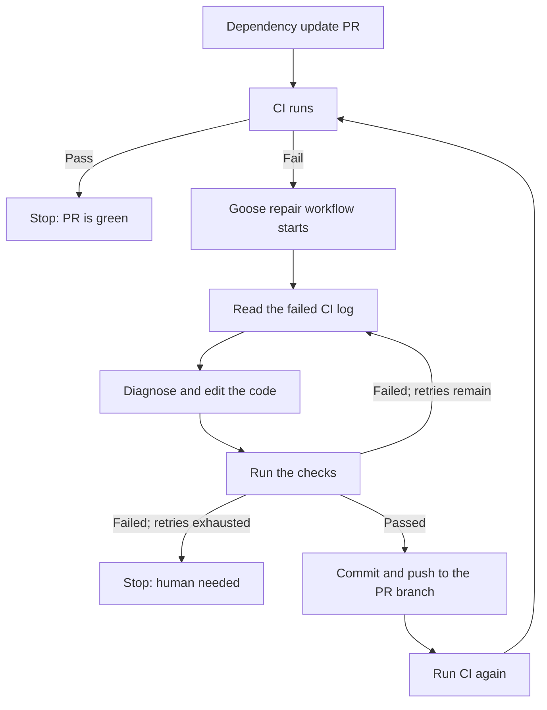

# Dependency Repair Loop with Goose

This repository demonstrates a closed CI repair loop. A dependency update
breaks a pull request, CI reports the failure, and Goose diagnoses the observed
error without being told which file or fix to use. Goose edits the code, checks
its work, and pushes the repair back to the same pull request. CI then runs
again, continuing the loop until the pull request is green or the retry limit is
reached.



The [worked example](https://github.com/anilmuppalla/goose-dependency-update-loop-demo/pull/1)
upgrades Mock Service Worker from `1.3.2` to `2.0.0` without updating the code
that uses it. The Goose workflow and recipe contain neither the expected error
nor migration instructions, so the repair must come from the failure Goose
actually observes.

<details>
<summary>Setup and implementation notes</summary>

### Repository settings

- Secret: `OPENAI_API_KEY`
- Variable: `GOOSE_MODEL`, set to `gpt-5.4-mini`

### How the demo is wired

- `.github/workflows/ci.yml` runs the repository checks.
- `.github/workflows/goose-update-shepherd.yml` starts after a failed CI run,
  checks out the failed pull-request branch, gives Goose the CI log, verifies
  the repair, and pushes it back to that branch.
- `.goose/dependency-update.yaml` is the generic repair recipe.
- CI is explicitly redispatched after the push because GitHub's default
  `GITHUB_TOKEN` does not create a fully automatic recursive workflow run.
- The inner Goose loop allows two repair retries. The outer CI loop stops after
  three Goose-authored commits.

### Run the baseline locally

```bash
npm ci --ignore-scripts
npm run check
```

`main` is green. The demo pull request is intentionally red until Goose pushes
the repair.

</details>
